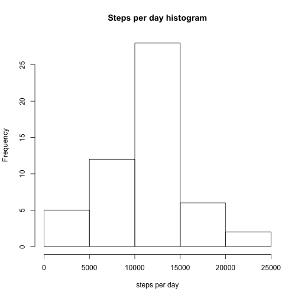

Reproducible Research Assignment 1
===================================

##Loading the data

```r
mydata <- read.csv("activity.csv")
```

##Converting column 'date' to R Date format

```r
mydata$date <- as.Date(mydata$date)
```

##What is mean total number of steps taken per day?
**Calculate the total number of steps taken per day**

```r
library(dplyr)
by_date <- group_by(mydata[!is.na(mydata$steps),], date)
total <- summarize(by_date, steps_per_day=sum(steps))
```

**Plot histogram of steps per day**

```r
hist(total$steps_per_day, main="Steps per day histogram", xlab="steps per day")
```

 

**Calculate and report the mean and median of the total number of steps taken per day**

```r
mymean <- mean(total$steps_per_day)
mymedian <- median(total$steps_per_day)
```
The mean value of steps per day is 10766.19 and median is 10765.

##What is the average daily activity pattern?
**Make a time series plot (i.e. type = "l") of the 5-minute interval (x-axis) and the average number of steps taken, averaged across all days (y-axis)**

```r
by_interval <- group_by(mydata[!is.na(mydata$steps),], interval)
avg_day <- summarize(by_interval, steps_in_interval=mean(steps))
plot(
        avg_day, 
        type='l', 
        main="Average number of steps in interval", 
        ylab="Average number of steps", 
        xlab="Interval")
```

 

**Which 5-minute interval, on average across all the days in the dataset, contains the maximum number of steps?**

```r
max_int <- as.numeric(avg_day[avg_day$steps_in_interval == max(avg_day$steps_in_interval), 1])
```
The interval with maximum number of steps across all the days is 835.

##Imputing missing values
**Calculate and report the total number of missing values in the dataset.**

```r
n_nas <- nrow(mydata) - sum(complete.cases(mydata))
```
There are 2304 rows with missing values.

**Devise a strategy for filling in all of the missing values in the dataset. The strategy does not need to be sophisticated. For example, you could use the mean/median for that day, or the mean for that 5-minute interval, etc.**  
Since there are large differences in the number of steps between various intervals, the missing values will be filled with the median value of steps for certain interval.

**Create a new dataset that is equal to the original dataset but with the missing data filled in.**

```r
median_day <- summarize(by_interval, steps_in_interval=median(steps))
new_steps <- apply(mydata, 1, function(x){
        if(is.na(x[1])){
                median_day$steps_in_interval[as.numeric(median_day$interval) == as.numeric(x[3])]
        }
        else{
                x[1]
        }
})
newdata <- mydata
newdata$steps <- as.numeric(unlist(new_steps))
```

**Make a histogram of the total number of steps taken each day and Calculate and report the mean and median total number of steps taken per day. Do these values differ from the estimates from the first part of the assignment? What is the impact of imputing missing data on the estimates of the total daily number of steps?**

```r
by_date2 <- group_by(newdata, date)
total2 <- summarize(by_date2, steps_per_day=sum(steps))
hist(total2$steps_per_day, main="Steps per day after missing data imputation", xlab="steps per day")
```

 

```r
mymean2 <- mean(total2$steps_per_day)
mymedian2 <- median(total2$steps_per_day)
```
The mean value of steps per day after missing data imputation is 9503.87 and the median is 10395.  
After the missing values imputation the left tail of the histogram is larger. The distribution does not seem to be normal any more. The mean and median values are lower than the ones calculated before the missing values imputation. All the above suggest that our procedure imputed mostly low values.

##Are there differences in activity patterns between weekdays and weekends?
**Create a new factor variable in the dataset with two levels – “weekday” and “weekend” indicating whether a given date is a weekday or weekend day.**

```r
daytype <- sapply(mydata$date, function(x)
        ifelse(weekdays(x) %in% c("Saturday", "Sunday"), "weekend", "weekday")
)
newdata$daytype <- as.factor(daytype)
```

**Make a panel plot containing a time series plot (i.e. type = "l") of the 5-minute interval (x-axis) and the average number of steps taken, averaged across all weekday days or weekend days (y-axis).**

```r
library(lattice)
by_interval2 <- group_by(newdata, interval, daytype)
avg_day2 <- summarize(by_interval2, steps_in_interval=mean(steps))
xyplot(
        steps_in_interval~interval|daytype, 
        data=avg_day2, 
        type="l", 
        main="Average number of steps per interval per type of day", 
        xlab="Interval", 
        ylab="Average number of steps", 
        layout=c(1,2))
```

 
